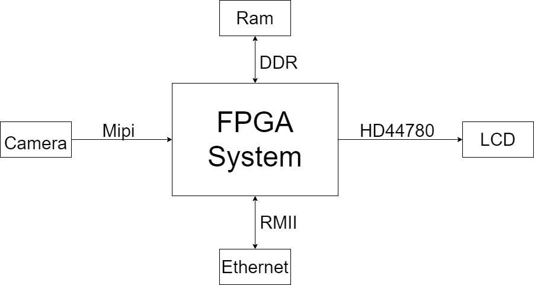

# Documentation

This is the main source of documentation, as such it will be the highest level. For better clarity diagrams will be attached.

##  Context diagram

With we will try to express the full IO of the system to start to specify the task to be realized.

With this, we see the IO requried for the project is the following:
- MIPI
- RMII
- HD44780 controller
- DDR controller

Aditionally we can see the hardware needed for the full project:
- MIPI Camera
- HD 44780 display
- DDR Ram chip
- Ethernet PHY

With this information, we can procede to select wich FPGA provides the resources needed and what balance of provided/external and connected will provide the best results.

## FPGA

Taking all of before into account the resulting FPGA selected is **PENDING**.

## BOM

We will have a list of materials attached as a CSV/Excel file for anyone to replicate the project [BOM](BOM.csv) .

## Requirements

In this part we will specify what functionality will be realized by the final system. For easier managment, the full specification will be set in a separate file: "**REQUIREMENTS.md**.

To give a sense of the purpouse of the project, this is what we expect to archieve:
+ Capture an image
+ Process a captured image with an OCR algorithm
+ Display the text from the image in the display
+ Send a IOT message containing the text in the image

